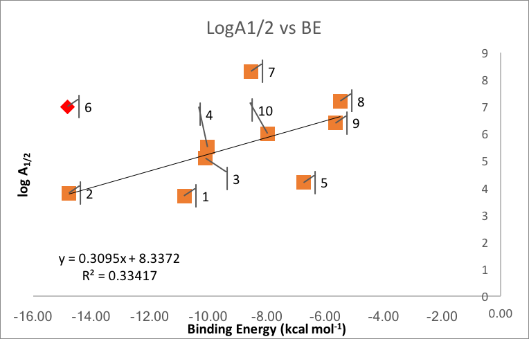

Arrhenius Pre-Factors and NCIs

Jeff van Santen

# Background
  - Arrhenius equation
    + Origins: phenomenological equation (arose from empirical measurements)
    + Recall k(T) = A exp(Ea/RT)
    + A = pre-exponential factor (A-factor)
      * Units of rate constant
      * Sometimes called "frequency factor"
        - described to undergraduates as factor which describes the collision behaviour or reactants
      * Generally assume A is temperature independent, although known to be weakly temperature dependent
      * For bimolecular reaction A can be subdivided in to collision factor Z from collision theory times steric factor (defined as Z/A)
        - Z from collision theory (Z = N_a * sigma_AB * sqrt(8*k_B*T/pi*mu_AB))
          + N_a = avogadros num, sigma_AB = reaction cross section, k_B = boltzmann cont., mu_AB = reduced mass of reactants
  - PCET vs HAT (From old intro) ?
    + Formal HAT vs PCET
      * Define formal HAT
        - Transfer of e- and H+ through same set of orbitals
      * Define Proton-coupled electron transfer (PCET)
        - Transfer of e- and H+ through different sets of orbitals

  - Motivation
    + Experimental results (recap) from Thermoneutral reactions of oxygen-centered pi-radicals
      * Results collected in study of PCET reactions of sigma radicals
        - 12 different sources, each with unique experiments
      * Table of results
    + A-factor useful concept for understanding experimental measurements
      * Important in describing rate constant when Ea is low (as is case for thermoneutral reactions)
      * Finding theoretical connection desirable goal
    + Expect strong NC binding nature of pairs in thermoneutral reactions to play important role in A-factor
      - currently no literature to suggest this
    + This is a novel exploration of the contribution of non-covalent binding to the A-factor
***
# Results and Discussion
  

  - Binding energy vs. log A
    * See poor correlation (R^2 = 0.33)
    * 1, 5, 6, 7 obvious outliers
      + neglecting these get good correlation (R^2 = 0.95)
    * How are outliers different?
      + 6 may possibly be ignored (only estimated A)
      + 7 only complex (besides 6) with direct pi-stacking like in slipped parallel benzene (BE ~ -2.7 kcal/mol)
      + 6 & 7 may have greater PCET overlap due to pi-pi overlap leading to increased rate constants (PCET is faster than HAT)
        - On basis of pre-reaction complex geometries, other reactions have non-ideal orbital overlap for PCET because of steric bulk (1-5) or electronic repulsion between peroxyl O-O and aromatic groups (8-10)
        - 6 & 7 may be faster due to better PCET overlap
      + 1 & 5
        - 1 has no H-bond
        - 5 has longest H-bond (2.05 AA) vs 1.6--2.0 AA
***
# Summary
  - For related reactions binding energy appears to correlate with A-factor
    + Deviations from this explained on the basis of structural or electronic differences
  - Further work in necessary to understand the importance of NCIs on A-factor magnitude
***
# Methods
  - Conformational Analysis
    + Monomers
    + Complexes
  - Final Binding Energies
