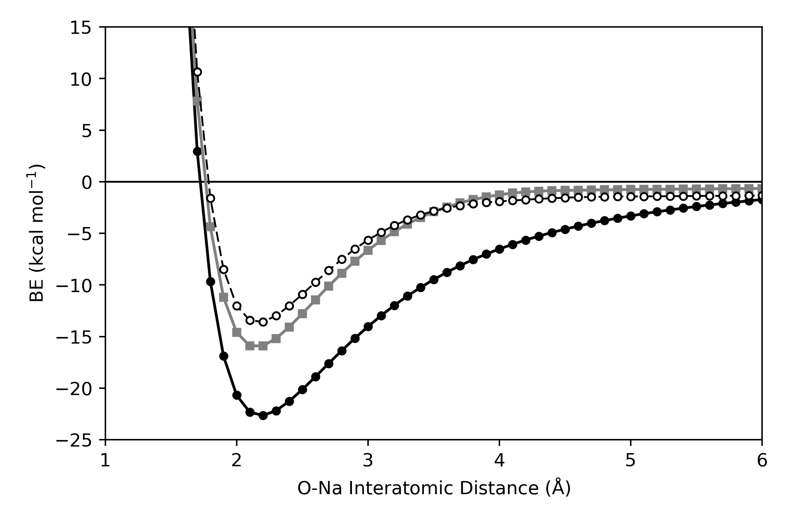
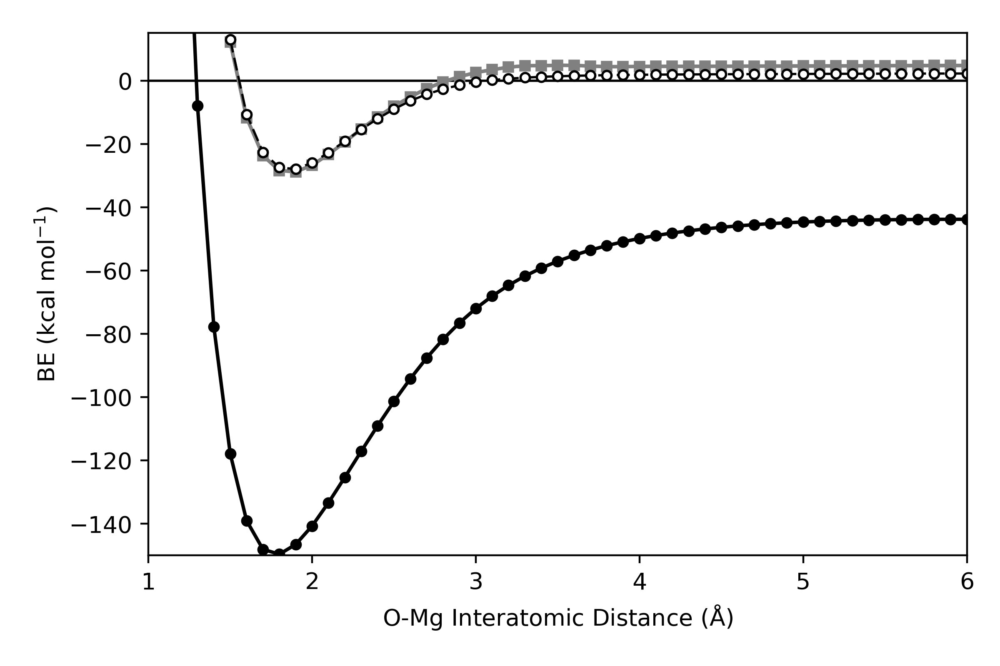
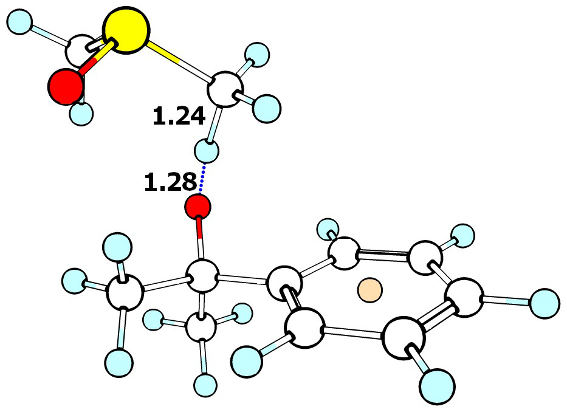

# Do non-redox active metal cations have the potentials to behave as chemo-protective agents? The Effects on Metal Cations on HAT Reaction Barrier Heights

## Introduction

* Metal cations in biological systems
  - Metals in protein have been studied extensively, and an active crystaligrophic database for protein structures w/ metal is kept\cite{Hsin2006}
  - Metals are present in ~40% of protein structures in PDB\cite{Harding2010, Berman2007}
  - Redox active metals often associated with catalytic activity as co-factors
  - Non-redox active metal cations ubiquitous in biochemical structures
    + Important in protein structures and function (Cite cellular biology textbook\cite{Karp1999})
    + Non-redox active metal cations bond predominantly through electrostatic intreactions
    + Bind predominantly to O centres in metals \cite{Harding1999, Harding2001}
    + Divalent ions tend to bind to protein directly (Ca 4-6 binding sites Mg 1-2 binding sites -> others occupied by water)
    + Monoionic ions tend to be solvated heavily but appear in solvent cavities of proteins (some bind to carbonyl or carboxylates)\cite{Harding2010}
  - Table of ionic concentrations inside mamallian cells (M. C.) and in blood (Units of mM)\cite{Karp1999, Milo2015} (http://book.bionumbers.org/what-are-the-concentrations-of-different-ions-in-cells/)

| Ion  |  M. C.             |  Blood  |
|------|--------------------|---------|
| K+   |        100         |    4    |
| Na+  |         10         | 100-200 |
| Mg2+ | 10(bound) 0.5(free)|    1    |
| Ca2+ |      0.01-0.1      |    2    |

* Experimental (and past theoretical) evidence for inhibition of reactivity
  - Recent experimental evidence for metal cation inhibit of HAT reactions b/w CumO* and organic substrates in MeCN at 298 K
  - First paper for CHD, THF, TEA, PMP \cite{Salamone2013a}
  - Second paper for DMF and DMA \cite{Salamone2015metals} (previously w/o metals\cite{Salamone2013})
  - Third paper bulky acetamides/alkanamides \cite{Salamone2016} (previously w/o metals\cite{Salamone2014})
  - Solvent hydrogen bond donation to amide/amine destabilises TS by decreasing electron density at incipient radical (DMSO worse hydrogen bond donor than MeCN)\cite{Salamone2015metals}
  - Metal cations w/ simple amides shown three-distinct regions of HAT reactivity: $k_{0}$ = full deactivation (only CumO beta-scission), $k_{H1}$ = moderate deactivation, $k_{H2}$ = minor deactivation
  - One previous theoretical study of TEA+Mg(ClO4)2-CumO rxn\cite{Nova2014}
    + Interested in in metal (redox or non-redox active) "protects" ligand

| Substrate  | Conditions        | $k_H$ ($M^{-1}s^{-1}$)|
|------------|-------------------|-----------------------|
| CHD        |                   | 6.7 $\times 10^7$     |
|            | LiClO4 1.0 M      | 7.5 $\times 10^7$     |
|            | Mg(ClO4)2 1.0 M   | 7.0 $\times 10^7$     |
| THF        |                   | 5.7 $\times 10^6$     |
|            | LiClO4 1.0 M      | 2.9 $\times 10^6$     |
|            | LiOTf 1.0 M       | 2.8 $\times 10^6$     |
|            | Mg(ClO4)2 1.0 M   | 1.8 $\times 10^6$     |
| TEA        |                   | 2.0 $\times 10^8$     |
|            | LiClO4 1.0 M      | 9.4 $\times 10^7$     |
|            | Mg(ClO4)2 0.005 M | $< 1 \times 10^6$     |
| PMP        |                   | 1.7 $\times 10^8$     |
|            | LiClO4 1.0M       | 9.0 $\times 10^7$     |
|            | Mg(ClO4)2 0.005 M | $< 1 \times 10^6$     |
| DMF        |                   | $1.2 \times 10^6$     |
|            | DMSO              | $2.5 \times 10^6$     |
| DMA        |                   | $1.2 \times 10^6$     |
|            | DMSO              | $2.4 \times 10^6$     |
| DIA        |                   | $3.1 \times 10^5$     |

* Several questions
  - What is the exact physico-chemical nature of C-H bond deactivation in amides?
    + Does binding actually decrease BDE?
    + How do metals effect polarity of TS complex?
    + Does structures of substrate effect ability of deactivation (DIA)
    + How do metal cations effect RO* reactions w/ of solvent molecules used in LFP (DMSO/HMPA)?  
    + Do we observe the same reactivity w/ biologically relevant HO*? ()
  - How well does DFT capture effects of metal cation binding?
    + Do we need counteranion? And does Cl- vs ClO4- matter?
    + Test case: unimolecular decay of CumO*

## Benchmarking DFT for metal cation substrate/radical binding

* Need to "calibrate" DFT-based methods before applying to unknown systems
* Previous studies w/ binding energies
  - Binding Energies Ca2+ with organic substrates\cite{Corral2003, Suarez2011}
  - Binding Enthalpies for Na+ and K+ w/ amides\cite{Siu2001} (Also expt \cite{Klassen1996})
  - Only studied several DFT methods and small variety in substrates
* One other previous study w/ relative conformer energies for Li+ binding to dipeptide models \cite{Baldauf2013}
* Wanted to study dipeptide models
  - Account for different amino acid side chains
  - Computational restrictions of CCSD(T) calculations did not allow for this
  - Still intent to perform these calcs w/ new computers
* Use small models for biomolecules, solvents used in kinetics studies, and radicals

### Methods
* Basis set convergence of metal cations!

* Final method CCSD(T)-F12*/Def2-QZVPPD
* Results - Metal cations approach CBS limit - verify w/ expt

### Results

* Table of CCSD(T)-F12*/Def2-QZVPPD Gas Phase Binding Energies

|             |   Li+  |   Na+   |    Mg++  |    K+   |   Ca++  |
|-------------|--------|---------|----------|---------|---------|
| H2O         | -34.65 |  -24.38 |  -81.95  |  -17.78 |  -56.80 |   
| NH3         | -39.93 |  -28.16 |  -98.12  |  -19.78 |  -65.34 |
| MeCN        | -44.44 |  -33.01 |  -113.08 |  -24.94 |  -80.72 |
| Formamide   | -50.69 |  -36.89 |  -128.19 |  -28.45 |  -96.05 |
| Formic Acid | -38.38 |  -26.99 |  -101.92 |  -19.96 |  -72.64 |
| HO          | -21.32 |  -16.81 |  -56.97  |  -12.40 |  -40.66 |
| HOO         | -27.12 |  -19.05 |  -72.15  |  -13.91 |  -48.95 |

* DFT Results - does basis set matter for binding? (Convergence of metals to CBS)

## Effects of metal cations on HAT reactions

### Methods
* On basis of benchmark and QM-ORSA
  - M05-2X/6-31+G** gas-phase optimizations
    + Attempted solvent phase optimizations, but many calculations failed
  - M05-2X/6-311+G(2d,2p) single point in continuum solvent SMD=MeCN to estimate solvent effects
  - NBO/NPA analysis used (As implemented in g09)
  - TS calculations were technically challenging
    + Required the use of CalcAll keyword - explain

### Exploring the Nature of metal cation substrate interactions

#### How long-range is the interaction b/w metal cation and substrates

* Expt'l results are in MeCN, but obviously biology happens in water
* Ingold and Litwienko have shown that C-H abstraction does not depend strongly on solvent\cite{Litwienko2007}
* Therefore, if MeCN and H2O have similar binding interactions, then extrapolating to biological systems is reasonable

* Literature suggest that metal cation-amide interaction are v. short range
  - Borrow information from studies of Hofmeister series
    + "spectroscopic experiments and molecular simulations show that biologically relevant ions can strongly influence only their immediate solvation shell and do not show any long-range kosmotropic effects in water"\cite{Omta2003, Funker2011}
    + "Cations Bind Only Weakly to Amides in Aqueous Solutions"\cite{Okur2013}
    * No experimental evidence of Na+ or K+ binding in aqua
    + Radial distribution function for Na/K w/ NMA in aq\cite{Heyda2009}
  - How short range is this interaction?
  - DMA--Na+
  
  - DMA--Na-Cl
  
  - DMA--Mg++
  
  - DMA--MgCl2
  

* Problems w/ Mg++ again
  - Explain on basis of IP of DMA vs Mg++
    + Expt'l IP of DMA = 8.8\cite{Slifkin1967}-9.2\cite{Baldwin1977} eV
    + Gas phase calc M05-2X/6-311+G(2d,2p) = 8.9 eV
    + Solvent calc M05-2X-SMD(MeCN)/6-311+G(2d,2p) = 6.4 eV
    + Expt'l 2nd IP for Mg is 15.0 eV \cite{CRC2016}
    + Gas phase M05-2X/6-311+G(2d,2p) = 14.9 eV
    + Solvent calc M05-2X-SMD(MeCN)/6-311+G(2d,2p) = 3.3 eV!
    + Na expt'l = 5.1 eV \cite{CRC2016} Gas = 5.0 eV Solvent = 1.9 eV
  - Also standard DFT-based methods cannot properly localize charges \cite{Cheng2016} because of delocalization error\cite{Cohen2008}
    + New schemes are being implemented to constrain charges in DFT\cite{Melander2016}
      * BH+HLYP is only hybrid which captures correct charge localization state
    + Possible future solution is DFT+U method\cite{Liechtenstein1995, Dudarev1998}
      * Treat charge localized sites with additional potential term
* Interaction is short range w/ implicit solvent
  - Less than 5 Angstrom

#### Do metal cations decrease BDEs?

  * Explanation was metal cation reducing BDE by decreasing hyperconjugative overlap
    - Is this the case?
  * Calculated BDEs(BDFEs) (kcal/mol) of substrates w/ M05-2X/6-311+G(2d,2p)-SMD//M05-2X/6-31+G** (ROCBS-QB3)

  

  | Substrate       | ROCBS-QB3  |    Bare    |     Na+    |    NaCl    |
  |-----------------|------------|------------|------------|------------|
  | DMA (acetyl)    | 99.5(91.3) | 98.5(90.3) | 97.8(91.0) | 98.4(90.4) |
  | DMA (cis)       | 93.9(86.0) | 92.2(84.5) | 93.2(85.8) | 94.0(89.4) |
  | DMA (trans)     | 92.3(84.3) | 91.6(83.4) | 92.8(85.5) | 92.6(86.1) |
  | DIA (acetyl)    | 99.1(90.7) | 97.8(89.0) | 97.5(89.1) | 97.7(88.9) |
  | DIA (a)         | 96.6(87.9) | 95.7(87.0) | 96.5(87.4) | 96.5(87.4) |
  | DIA (b)         | 97.9(88.1) | 96.4(86.4) | 94.8(85.2) | 93.1(84.3) |
  | DIA (c)         | 93.1(84.7) | 93.0(84.2) | 93.8(84.9) | 94.0       |
  | DIA (d)         | 96.9(87.0) | 95.3(85.4) | 95.5(85.3) | 95.5(85.34)|
  | DMSO            | 102.2(93.6)| 103.4(94.7)| 104.4(95.5)| 103.7(97.4)|
  | MeCN            | 96.6(88.3) | 97.4(89.1) | 98.3(89.9) | 98.1(89.8) |

  

  
  

  * Yes, metal cation binding do decrease BDEs
    - Abundant technical problems
      + For DMA, DFT-based method says acetyl BDE decreases, while ROCBS-QB3 says the opposite
      + Also, see problems with Mg++ and MgCl2 -> IP of substrates are too close to Mg++

  * NPA/NBO analysis reveals that binding of metal changes preference of resonance form
      - Normally about an even split of LH vs/ RH but binding changes increases RH character
      - Increases effective charge at Carbonyl C, therefore increasing hyperconjugative overlap w/ acetyl and decreasing BDE
      - Decreases effective charge at N, therefore decreases hyperconjugative overlap w/ cis/trans and increases BDE

  * DIA rad b (cis beta) - stabilized by binding of Na/NaCl to O: and C*

  ### How well does DFT capture unimolecular decay of CumO* w/ metals?

  * Main decay path of CumO* (as in BDE Ch.) = CumO* -> Acetophenone + CH3* ($k_\beta = 6.3 \times 10^5 s^{-1}$ \cite{Avila1993, Avila1995} in MeCN @ 298 K)
  * Interaction w/ O* results in increase in beta-scission rate -> stabilises TS complex relative to Complex b/c stronger interaction w/ more sp2-like O than sp3
  * Exptl (Dependent on Conc. M+) for 1.0M of three salts: LiClO4 ($k_\beta = 1.8 \times 10^6 s^{-1}$), Mg(ClO4)2 ($k_\beta = 1.6 \times 10^6 s^{-1}$), NaClO4 ($k_\beta = 1.1 \times 10^6 s^{-1}$)
  * Results: M05-2X-SMD/6-311+G(2d,2p)//M05-2X/6-31+G**

  

  |   Species    |  $k_H$ (Calc)      | $\Delta \Delta G^\ddagger$ |
  |--------------|--------------------|----------------------------|
  |  TS          |  $2.7 \times 10^5$ |   0.0                      |
  |  TS-Na       |  $7.8 \times 10^7$ |  -3.4                      |
  |  TS-Na-ClO4  |  $3.2 \times 10^6$ |  -1.5                      |
  |  TS-Na-Cl    |  $1.8 \times 10^7$ |  -2.5                      |
  |  TS-Mg-Cl2   | $2.1\times10^{12}$ |  -9.4                      |          

  

  * Calculated kH is in reasonable agreement w/ experiment
  * Bare metal cation over estimate effects of metal cation binding
    - perturb CumO electron density too much
  * Include counteranions
    - experiments use ClO4- because of solubility in MeCN
    - Calculations w/ Na+ and Cl- or ClO4- show both diminish effects of cation both still over estimate effects
      + Differences in minimum energy structures
      + Cl- and ClO4- change degree to which Na+ pulls electron density to O* and stabilizes TS complex
      + NPA charges on O* for TS = -0.64 e- Na+ = -0.77 NaCl = -0.72 NaClO4 = -0.69
    - Calculations w/ Mg2+ are problematic
      + TS of CumO--Mg2+ has vibration, but does not connect reactants to products
      + Only converged structure is for MgCl2 but the TS is overly stabilized
        * IP of Mg2+ and CumO*-TS are too close --> never observe in realistic system
  * Overall: poor description of system. Tried including explicit solvent molecules, but no resolution
    - Chose to continue work with NaCl (and continue trying with MgCl2) as these are smaller systems
    - May actually be advantageous for the effects to be exaggerated, as they are subtle experimentally (i.e. only 2-3 fold in some cases which is about 0.4 kcal/mol wrt $\Delta G^\ddagger$)

### Reactions of DMA w/ RO*

* DMA w/ CumO and BnO studied in \cite{Salamone2013}
  - BnO described as having being kinetically limited by formation of strong pre-reaction complex w/ $\alpha$-C-H of BnO
    + $k_H'$ is unimolecular and dominant for cis-N-methyl where $\Delta G^\ddagger$ = 5.7 kcal/mol ($5.4 \times 10^8 s^{-1}$)
  - CumO has non-specific binding due to lack of hydrogen bond donation group but increased dispersion interactions w/ methyl groups

|   Reaction   |  Abstraction Site   |  $\Delta G(H)^\ddagger$ |  $\Delta \Delta G(H)^\ddagger$ |
|--------------|---------------------|----------------------|-----------------------------|
|  DMA + CumO  |  trans              |  17.3(3.4)           |                             |
|              |  cis                |  17.5(3.8)           |                             |
|              |  acetyl             |  21.6(7.5)           |                             |
|DMA-Na-Cl+CumO|  trans              |  20.3(3.7)           |    3.0(0.3)                 |
|              |  cis                |  18.4(1.2)           |    0.9(-2.6)                |
|              |  acetyl             |  21.0(4.3)           |   -0.6(-3.2)                |
|  DMA + BnO   |  trans              |  16.5(3.7)           |                             |
|              |  cis                |  17.5(3.6)           |                             |
|              |  acetyl             |  20.8(7.8)           |                             |
|DMA-Na-Cl+BnO |  trans              |  18.6(1.7)           |    2.1(-2.0)                |
|              |  cis                |  17.8(4.7)           |    0.3(1.1)                 |
|              |  acetyl             |  22.0(4.7)           |    1.2(-3.1)                |

#### Full RXN coordinates into Appendix
DMA-BnO

DMA-BnO-NaCl

DMA-CumO

DMA-CumO-NaCl

* Calculated barrier are much higher than previous and are in poor agreement with experiment
  - Geometries are similar to previously calculated
* Continued w/ M05-2X as it appears to give reasonable relative energies and thus should still help provide insight --> i.e. relative energies will be the important part
+ Strongly bonded pre-reaction complexes - Binding w/ aromatic ring of CumO/BnO (BE = 3 - 6 kcalmol for CumO and 6 - 19 kcalmol for BnO)
* For DMA + CumO, Na-Cl decreases barrier for acetyl, and increases cis/trans
  - Expected on basis of hypothesis
  - For Trans - the amount of charge separation in TS is less than for acetyl and cis accounting
    + greater effect because charge separation stabilizes TS
* For DMA + BnO, Na-Cl increases barrier for all bonds
  - Difference in acetyl from CumO?
    + Na-Cl interacting with aromatic ring in TS (only case where this happens)
      * Stretches Na--O interaction and may decreases effect
      * Could be calculation error - unable to isolate another TS structure

* DMA w/ HO* experimentally studies in 1970\cite{Hayon1970}
  - On basis of UV-Vis ~90% of abstraction takes place from N-methyl sites
  - $k_H = 3.5 \times 10^9 M^{-1}s^{-1}$ in Water by pulse radiolysis expt.
  - Snelgrove-Ingold equation \cite{Snelgrove2001} gives estimated kH in MeCN
    + alpha DMA = 0.73, beta H2O = 0.38, beta MeCN = 0.44 \cite{Abraham2010}
    + H2O: log(3.5E9) = X - 8.3*0.73*0.38 --> X = 12.846
    + MeCN: Y = 12.846 - 8.3*0.73*0.44 --> Y = 10.181 --> kH = 1.5E10
  - HO* ~100x faster reaction than BnO and 10000x faster reaction than CumO
    + Only frozen TS structures for DMA+OH -> contain one imaginary frequency :. proper TS structures

  |   Reaction   |  Abstraction Site   |  $\Delta G(H)^\ddagger$ |  $\Delta \Delta G(H)^\ddagger$ |
  |--------------|---------------------|----------------------|-----------------------------|
  |  DMA + HO    |  trans              |  8.9(0.0)            |                             |
  |              |  cis                |  7.9(-2.7)           |                             |
  |              |  acetyl             |  9.9(0.5)            |                             |
  |DMA-Na-Cl+HO  |  trans              |             |                    |
  |              |  cis                |             |                    |
  |              |  acetyl             |             |                    |  

### Reactions of DIA w/ RO*

|   Reaction   |  Abstraction Site   |  $\Delta G^\ddagger$ |  $\Delta \Delta G^\ddagger$ |
|--------------|---------------------|----------------------|-----------------------------|
|  DIA + CumO  |  alpha-trans        |  22.3                |                             |
|              |  alpha-cis          |  19.1                |                             |
|              |  acetyl             |  19.1                |                             |
|              |  beta-trans         |  18.6                |                             |
|              |  beta-cis           |  18.4                |                             |
|DIA-Na-Cl+CumO|  alpha-trans        |                  |                             |
|              |  alpha-cis          |                  |                             |
|              |  acetyl             |                  |                             |
|              |  beta-trans         |                  |                             |
|              |  beta-cis           |                  |                             |
|  DIA + BnO   |  alpha-trans        |  20.4                |                             |
|              |  alpha-cis          |  18.6                |                             |
|              |  acetyl             |  19.8                |                             |
|              |  beta-trans         |  15.9                |                         |
|              |  beta-cis           |  19.1                |                         |
|DIA-Na-Cl+BnO |  alpha-trans        |                  |                             |
|              |  alpha-cis          |                  |                             |
|              |  acetyl             |                  |                             |
|              |  beta-trans         |                  |                             |
|              |  beta-cis           |                  |                             |

### Reactions of DMSO w/ RO*

|   Reaction   | Orientation|  $\Delta G(H)^\ddagger$ |  $\Delta \Delta G(H)^\ddagger$ |
|--------------|------------|----------------------|-----------------------------|
|  DMSO + CumO | Open       |  20.9(8.9)           |                             |
|DMSO-NaCl+CumO| Cisoid     |  22.4(5.2)           |  1.5(-3.7)                  |
| DMSO + BnO   | ALT        |  10.4(-2.2)          |                             |
| DMSO-NaCl+BnO| ALT        |  13.4(-3.4)          |  2.0(-1.2)                  |
| DMSO + BnO   | Cisoid     |  22.7(10.4)          |                             |
| DMSO-NaCl+BnO| Cisoid     |  22.1(7.8)           |                             |

DMSO-CumO (red = NaCl)

DMSO-BnO (red = NaCl)

### Reactions of HMPA w/ RO*

* Alt reaction won't happen b/c products too high in energy even though TS is lower in energy

|   Reaction   |  $\Delta G^\ddagger$ |  $\Delta \Delta G^\ddagger$ |
|--------------|----------------------|-----------------------------|
|  HMPA + CumO |  17.4                |                             |
|HMPA-NaCl+CumO|                  |                             |
|  HMPA + BnO  |  16.0                |                             |
|HMPA-NaCl+BnO |                  |                             |

### Reactions of TBPO w/ RO*

* Alt reaction won't happen b/c products too high in energy even though TS is lower in energy

|   Reaction   |  $\Delta G^\ddagger$ |  $\Delta \Delta G^\ddagger$ |
|--------------|----------------------|-----------------------------|
|  TBPO + CumO |  20.1                |                             |
|TBPO-NaCl+CumO|                  |                             |
|  TBPO + BnO  |  19.0                |                             |
|TBPO-NaCl+BnO |                  |                             |
